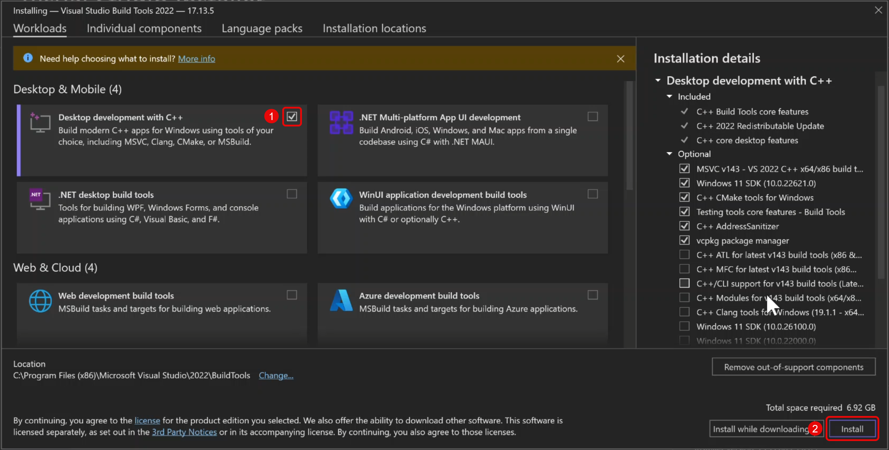

# Attendance System with Face Recognition

- Developer: MUY SENGLY
- Telegram: https://t.me/muysengly

# How to setup?

---

## Step 1: Download Project

### 1.1. Download the repository

- **Link**: https://github.com/muysengly/proj_attendance


### 1.2. Unzip the downloaded file.

- **Recommended**: Unzip the file to `Desktop`.

---

## Step 2: Download and install Visual Studio Build Tools

### 2.1. Download Visual Studio Build Tools

- **Link**: https://aka.ms/vs/17/release/vs_BuildTools.exe

### 2.2. Install Visual Studio Build Tools with C++ Build Tools



---

## Step 3: Download and install Python 3.12

### 3.1. Download Python 3.12

- **Link**: https://www.python.org/ftp/python/3.12.9/python-3.12.9-amd64.exe

### 3.2. Install Python 3.12


---

## Step 4: Setup Project

### 4.1. Run bat file to install required libraries

- Run a file with name: `setup_online.bat`

**NOTE**: if you have problem with `setup_online.bat`, please contact me

---

## Step 5: Configure database

### 5.1. Configure database folder

- To set up the `database` folder, create empty subfolders for each `group name` and further subfolders within them for each `student name`.

**Example**: Database folder structure

```
...
database/
├── MY GROUP A/
│   ├── STUDENT A1/
│   │   ├── image1.jpg
│   │   ...
│   ├── STUDENT A2/
│   │   ├── image1.jpg
│   │   ...
├── MY GROUP B/
│   ├── STUDENT B1/
│   │   ├── image1.jpg
│   │   ...
│   ├── STUDENT B2/
│   │   ├── image1.jpg
│   │   ...
...
```

---

## Step 6: Run the project

### 6.1. Run the project

- **Run**: `python main.py`
