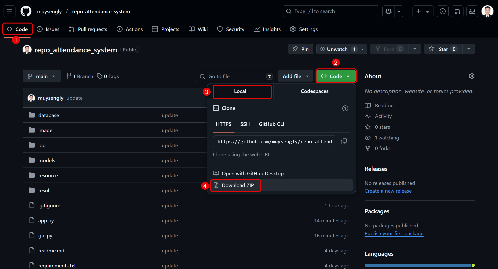
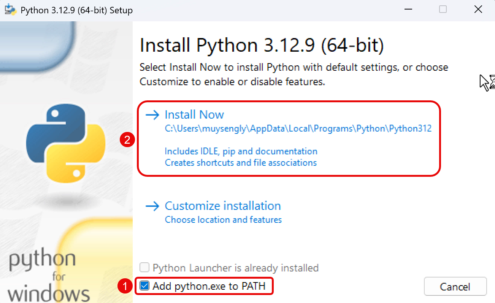

# Attendance System with Face Recognition

- Developer: MUY SENGLY
- Telegram: https://t.me/muysengly

# How To Setup?

---

## Step 1: Download Project

### 1.1. Download The Repository

- **Link**: https://github.com/muysengly/proj_attendance

### 1.2. Unzip The Downloaded File.

- **Recommended**: Unzip the file to `Desktop`.

---

## Step 2: Download And Install Visual Studio Build Tools

### 2.1. Download Visual Studio Build Tools

- **Link**: https://aka.ms/vs/17/release/vs_BuildTools.exe

### 2.2. Install Visual Studio Build Tools with C++ Build Tools

---

## Step 3: Download And Install Python 3.12

### 3.1. Download Python 3.12

- **Link**: https://www.python.org/ftp/python/3.12.9/python-3.12.9-amd64.exe

### 3.2. Install Python 3.12

---

## Step 4: Setup Project

### 4.1. Run Bat File To Install Required Libraries

- Run a file with name: `setup_online.bat`

**NOTE**: if you have problem with `setup_online.bat`, please contact me

---

---

## Step 5: Run The Project

### 5.1. Run The Project

- **Run**: `python Main.py`
